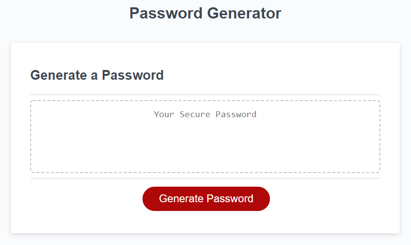

# Password-Generator

## Description

This module consisted of Javascript and how developers can enhance a webpage beyond HTML and CSS. Javascript ultimately is needed in order for users to interact on webpages. With CSS you are doing basic styling and Javascript takes it a bit further with console log, methods, properties, etc. Specifically, in this module, I was asked to modify a starter code for users to generate a random passcode through a generator. By doing so, HTML can be linked to JS with the script.js tag. Variables were used to create a value for classes and IDs. Those classes and IDs can be targeted through Javascript with var tag and name given. To link with the actual webpage "window.prompt" can be used and within "if, if else and else" are used to give user instructions and mandatory actions. In this module I learned how to enhance a webpage with Javascript and make it more user friendly. Accessibily points can also be pointed out. 

# The Challenge: 
This week's Challenge requires you to modify starter code to create an application that enables employees to generate random passwords based on criteria that they’ve selected. This app will run in the browser and will feature dynamically updated HTML and CSS powered by JavaScript code that you write. It will have a clean and polished, responsive user interface that adapts to multiple screen sizes.

## Usage

## Author

Follow me on Github at [felipeokay](https://github.com/felipeokay) 

For any questions please contact me via email at: Kevinserrano0823@gmail.com